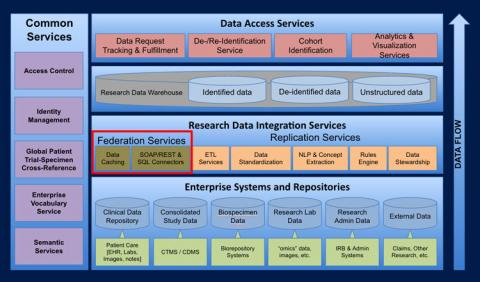



### The Problem

Medical researchers are faced with a complex and changing data landscape.

* Disparate data silos

* Distinct data storage systems

* Distributed data owners

* Dynamic unstructured data with high volume, variety, and velocity

### Solution

The MedBus Service-Oriented Architecture (SOA) contributes to the MSIS Research IT strategic goal of building and deploying federated data integration services. These integration services are being developed as part of a broader Research Data Strategy Architecture.

A Service-Oriented Architecture (SOA) framework for data federation provides a simplified and flexible connection to research data sources.

* Facilitates data discovery

* Increases data interoperability

* Leverages existing domain specific talent and knowledge

* Accelerates alignment of IT resources to shifting research needs
